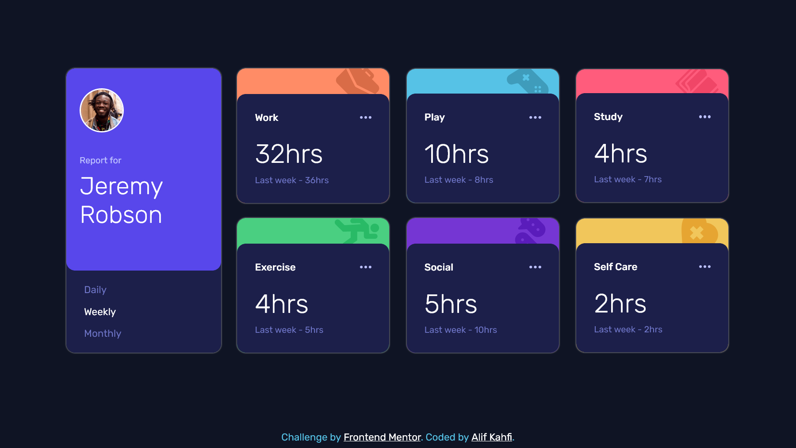
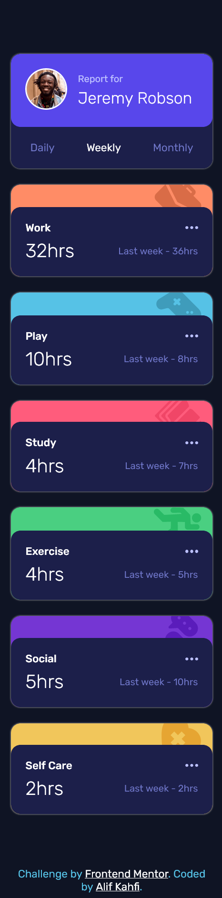

# Frontend Mentor - Time tracking dashboard solution

This is a solution to the [Time tracking dashboard challenge on Frontend Mentor](https://www.frontendmentor.io/challenges/time-tracking-dashboard-UIQ7167Jw). Frontend Mentor challenges help you improve your coding skills by building realistic projects. 

## Table of contents

- [Overview](#overview)
  - [The challenge](#the-challenge)
  - [Screenshot](#screenshot)
  - [Links](#links)
- [My process](#my-process)
  - [Built with](#built-with)
  - [What I learned](#what-i-learned)
- [Author](#author)

## Overview

### The challenge

Users should be able to:

- View the optimal layout for the site depending on their device's screen size
- See hover states for all interactive elements on the page
- Switch between viewing Daily, Weekly, and Monthly stats

### Screenshot

- Desktop:

- Mobile: 

### Links

- Solution URL: [Frontend Mentor solution](https://www.frontendmentor.io/solutions/time-tracking-dashboard-XvqZhBVgVe)
- Live Site URL: [Live site using vercel](https://time-tracking-dashboard-main-kappa.vercel.app)

## My process

### Built with

- Semantic HTML5 markup
- SCSS / SASS
- Flexbox
- CSS Grid
- Mobile-first workflow
- [React](https://reactjs.org/) - JS library

### What I learned

In this chalenge I had learned how to use many components in react js. I also had learned using sass properly in react js

## Author

- Instagram - [alifkm](https://www.instagram.com/alifkm/)
- Frontend Mentor - [Alifkm](https://www.frontendmentor.io/profile/Alifkm)
- Twitter - [alifkahfi10](https://twitter.com/AlifKahfi10?t=nxZrhm9DfsdiNFUcbeGSZA&s=06)